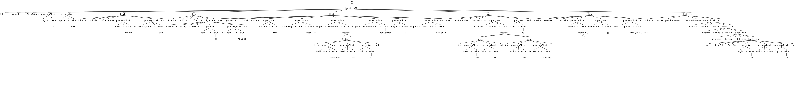
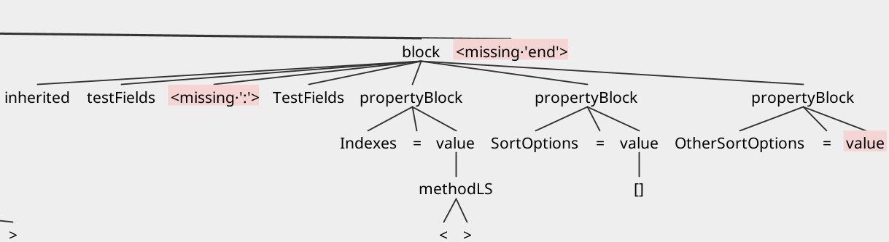

# DFM Parsing with ANTLR4

In this section we will leverage our refined DFM grammar to parse an example DFM file. We will describe the techniques needed to parse a DFM file with *ANTLR4*, and examine the outputs.

### Setup

For parsing a DFM file with our grammar, we will first need to set up *ANTLR*.

##### Prerequisites

- [Java JDK](https://www.oracle.com/java/technologies/downloads/#jdk26-windows) (latest but earlier versions should work) 
- [ANTLRv4 complete jar](https://www.antlr.org/download.html)

*ANTLR* can be manually downloaded from the source above, or using the command line tool `curl` to grab it:

```bash
$ cd /usr/local/lib
# check latest version (at the time of writing this documentation 4.13.2 is the latest)
$ curl -O http://www.antlr.org/download/antlr-4.13.2-complete.jar
```

**Instructions:**

1. Copy the downloaded tool where usually third-party java libraries live (up to preference); Example: `/usr/local/lib` or `C:\Program Files\Java\libs`
2. Add tool to `CLASSPATH` and to startup script (Example: `.bash_profile`)
3. Optional: also add aliases to startup script to simplify the usage of *ANTLR*

**Linux/MacOS:**

```bash
# 1.
sudo cp antlr-4.x-complete.jar /usr/local/lib/
# 2. and 3.
# add this to .bash_profile
export CLASSPATH=".:/usr/local/lib/antlr-4.x-complete.jar:$CLASSPATH"
# simplify the use of the tool to generate lexer and parser
alias antlr4='java -jar /usr/local/lib/antlr-4.x-complete.jar'
# simplify the use of the tool to test the generated code
alias grun='java org.antlr.v4.gui.TestRig'
# set up alias for java compiler
alias javac='javac -cp ".:/usr/local/lib/antlr-4.x-complete.jar"'
```

**Windows:**

```bash
# 1. Copy antlr-4.x-complete.jar in C:\Program Files\Java\libs (or wherever preferred)
# 2. Append the location of ANTLR to the CLASSPATH variable, or create a CLASSPATH variable if haven't already done so
# by pressing WIN + R and typing sysdm.cpl, then selecting Advanced (tab) > Environment variables > System Variables
# CLASSPATH -> .;C:\Program Files\Java\libs\antlr-4.x-complete.jar;%CLASSPATH%
# 3. Add aliases
# create antlr4.bat  
java org.antlr.v4.Tool %* 
# create grun.bat  
java org.antlr.v4.gui.TestRig %*
# put them in the system PATH or any of the directories included in PATH
```

Replace `4.x` with the downloaded version.

**Notice**: we will be assuming that the reader is using the same aliases as the ones specified above.

## Let's Parse!

Now that the setup is complete, the time has come to parse some DFM code.

First things first, let's copy our DFM grammar into a fresh directory, included in a file with the `.g4` extension.

**Notice**: remember that the file name has to correspond to the grammar specification in the `.g4` file.

```../dir/DelphiDFM.g4``` <=> ```grammar DelphiDFM ;```

Next, we generate the lexer and parser using *ANTLR*:

```antlr4 DelphiDFM.g4```

Output:

```bash
ls

DelphiDFMBaseListener.java  
DelphiDFMLexer.interp  
DelphiDFMListener.java
DelphiDFM.g4                
DelphiDFMLexer.java    
DelphiDFMParser.java
DelphiDFM.interp            
DelphiDFMLexer.tokens  
DelphiDFM.tokens
```

Great! The next step is to compile all `.java` files generated, like so:

```javac *.java```

Now we get the compiled files:

```bash
ls

DelphiDFMBaseListener.class  
DelphiDFMBaseListener.java   
DelphiDFM.g4                 
DelphiDFM.interp             
DelphiDFMLexer.class         
DelphiDFMLexer.interp        
DelphiDFMLexer.java          
DelphiDFMLexer.tokens        
DelphiDFMListener.class      
DelphiDFMListener.java
'DelphiDFMParser$BlockContext.class'
'DelphiDFMParser$FileContext.class'
'DelphiDFMParser$ItemContext.class'
'DelphiDFMParser$MethodLSContext.class'
'DelphiDFMParser$PropertyBlockContext.class'
'DelphiDFMParser$ValueContext.class'
 DelphiDFMParser.class
 DelphiDFMParser.java
 DelphiDFM.tokens
```

Aha! Now we can see our parser rules as well.


### Test Against a DFM File

The only thing we are missing is a test file that we should parse. The DFM file below was conceived to test all rules we previously defined in our grammar:

`../dir/test.dfm`
```ini
inherited frmActions: TfrmActions
    Tag = 3
    Caption = 'hello'
    inherited pnlTitle: TfrmTitleBar
        Color = clWhite
        ParentBackground = False
    end
    inherited pnlError: TfrmError
        inherited lblMessage: TcxLabel
            AnchorY = -18
            FloatAnchorY = 18.7283
        end
    end
    object gvListUser: TcxGridDBColumn
        Caption = 'Test'
        DataBinding.FieldName = 'TestUser'
        Properties.ListColumns = <
            item
                FieldName = 'fullName'
                Fixed = True
                Width = 100
            end>
        Properties.Alignment.Vert = taVCencter
        Height = 20
        Properties.DateButtons = [btnToday]
    end
    object testItemHchy: TestItemHchy
        Properties.ListColumns = <
        item
            Fixed = True
            Width = 80
        end
        item
            Width = 200
            FieldName = 'testing'
        end>
        Width = 282
    end
    inherited testFields: TestFields
        Indexes = <>
        SortOptions = []
        OtherSortOptions = [test1, test2, test3]
    end
    inherited testMultipleInheritance: TestMultipleInheritance
        inherited inhOne: InhOne
            inherited inhTwo: InhTwo
                inherited inhThree: InhThree
                    object deepObj: DeepObj
                        Height = 10
                        Width = 20
                        Top = 30
                    end
                end
            end
        end
    end
end
```

### Token Testing

Now we have all necessary components. First, let's take a look at all identified tokens from our `test.dfm` file. We use `grun`, which is the alias for *ANTLR's* testing rig: `org.antlr.v4.gui.TestRig`.

We use the command:

```grun DelphiDFM file -tokens test.dfm```

And our output:

```bash
[@0,0:8='inherited',<'inherited'>,1:0]
[@1,10:19='frmActions',<ID>,1:10]
[@2,20:20=':',<':'>,1:20]
[@3,22:32='TfrmActions',<ID>,1:22]
[@4,38:40='Tag',<ID>,2:4]
[@5,42:42='=',<'='>,2:8]
[@6,44:44='3',<INT>,2:10]
[@7,50:56='Caption',<ID>,3:4]
[@8,58:58='=',<'='>,3:12]
[@9,60:66=''hello'',<STRING>,3:14]
[@10,72:80='inherited',<'inherited'>,4:4]
[@11,82:89='pnlTitle',<ID>,4:14]
[@12,90:90=':',<':'>,4:22]
[@13,92:103='TfrmTitleBar',<ID>,4:24]
[@14,113:117='Color',<ID>,5:8]
[@15,119:119='=',<'='>,5:14]
[@16,121:127='clWhite',<ID>,5:16]
[@17,137:152='ParentBackground',<ID>,6:8]
[@18,154:154='=',<'='>,6:25]
[@19,156:160='False',<ID>,6:27]
[@20,166:168='end',<'end'>,7:4]
[@21,174:182='inherited',<'inherited'>,8:4]
[@22,184:191='pnlError',<ID>,8:14]
[@23,192:192=':',<':'>,8:22]
[@24,194:202='TfrmError',<ID>,8:24]
[@25,212:220='inherited',<'inherited'>,9:8]
[@26,222:231='lblMessage',<ID>,9:18]
[@27,232:232=':',<':'>,9:28]
[@28,234:241='TcxLabel',<ID>,9:30]
[@29,255:261='AnchorY',<ID>,10:12]
[@30,263:263='=',<'='>,10:20]
[@31,265:267='-18',<INT>,10:22]
[@32,281:292='FloatAnchorY',<ID>,11:12]

...

```
Continued further until all tokens are consumed.

**Note** that in our given command, `file` specifies the rule that needs to contain our input.

##### Token Decomposition

Now we can see an output of all identified tokens from our test file. Let's decompose a token so we understand how they are built. For instance, our second token:

```[@1,10:19='frmActions',<ID>,1:10]```

Each line of the output represents a single token and shows everything we know about the token: 

- `@1` indicates that it is the second token (indexed from 0).
- `10:19=` indicates that it goes from character position 10 to 19 (inclusive starting from 0).
- `'frmActions'` indicates what text it has.
- `<ID>` indicates the type of token.
- finally, `1:10` indicates that it is on line 1 (from 1), and is at character position 10 (starting from zero and counting tabs as a single character).

### Trees

So what if we want to see our parse tree? Let's see the command for that:

```grun DelphiDFM file -tree test.dfm```

And our output:

```yaml
(file 
    (block inherited frmActions : TfrmActions 
        (propertyBlock Tag = (value 3)) 
        (propertyBlock Caption = (value 'hello')) 
        (block inherited pnlTitle : TfrmTitleBar 
            (propertyBlock Color = (value clWhite)) 
            (propertyBlock ParentBackground = (value False)) 
        end) 

        (block inherited pnlError : TfrmError 
            (block inherited lblMessage : TcxLabel 
                (propertyBlock AnchorY = (value -18)) 
                (propertyBlock FloatAnchorY = (value 18.7283)) 
            end) 
        end) 

        (block object gvListUser : TcxGridDBColumn 
            (propertyBlock Caption = (value 'Test')) 
            (propertyBlock DataBinding.FieldName = (value 'TestUser')) 
            (propertyBlock Properties.ListColumns = (value 
                (methodLS < (item item 
                    (propertyBlock FieldName = (value 'fullName')) 
                    (propertyBlock Fixed = (value True)) 
                    (propertyBlock Width = (value 100)) 
                end) >))) 
            (propertyBlock Properties.Alignment.Vert = (value taVCencter)) 
            (propertyBlock Height = (value 20)) 
            (propertyBlock Properties.DateButtons = (value [btnToday])) 
        end) 

        (block object testItemHchy : TestItemHchy 
            (propertyBlock Properties.ListColumns = (value 
                (methodLS < (item item 
                    (propertyBlock Fixed = (value True)) 
                    (propertyBlock Width = (value 80)) 
                end) 
                (item item 
                    (propertyBlock Width = (value 200)) 
                    (propertyBlock FieldName = (value 'testing')) 
                end) >))) 
            (propertyBlock Width = (value 282)) 
        end) 

        (block inherited testFields : TestFields 
            (propertyBlock Indexes = (value (methodLS < >))) 
            (propertyBlock SortOptions = (value [])) 
            (propertyBlock OtherSortOptions = (value [test1, test2, test3]))
        end) 

        (block inherited testMultipleInheritance : TestMultipleInheritance
            (block inherited inhOne : InhOne 
                (block inherited inhTwo : InhTwo 
                    (block inherited inhThree : InhThree 
                        (block object deepObj : DeepObj 
                            (propertyBlock Height = (value 10)) 
                            (propertyBlock Width = (value 20)) 
                            (propertyBlock Top = (value 30)) 
                        end) 
                    end) 
                end) 
            end) 
        end) 
    end) 
<EOF>)
```

<span style="color:red">NOTE:</span> The output above was manually modified with newlines for readability purposes, to ultimately demonstrate the presence of hierarchy. 

The real output is actually a continuous line, and looks like this:

```ini
(file (block inherited frmActions : TfrmActions (propertyBlock Tag = (value 3)) (propertyBlock Caption = (value 'hello')) (block inherited pnlTitle : TfrmTitleBar (propertyBlock Color = (value clWhite)) (propertyBlock ParentBackground = (value False)) end) (block inherited pnlError : TfrmError (block inherited lblMessage : TcxLabel (propertyBlock AnchorY = (value -18)) (propertyBlock FloatAnchorY = (value 18.7283)) end) end) (block object gvListUser : TcxGridDBColumn (propertyBlock Caption = (value 'Test')) (propertyBlock DataBinding.FieldName = (value 'TestUser')) (propertyBlock Properties.ListColumns = (value (methodLS < (item item (propertyBlock FieldName = (value 'fullName')) (propertyBlock Fixed = (value True)) (propertyBlock Width = (value 100)) end) >))) (propertyBlock Properties.Alignment.Vert = (value taVCencter)) (propertyBlock Height = (value 20)) (propertyBlock Properties.DateButtons = (value [btnToday])) end) (block object testItemHchy : TestItemHchy (propertyBlock Properties.ListColumns = (value (methodLS < (item item (propertyBlock Fixed = (value True)) (propertyBlock Width = (value 80)) end) (item item (propertyBlock Width = (value 200)) (propertyBlock FieldName = (value 'testing')) end) >))) (propertyBlock Width = (value 282)) end) (block inherited testFields : TestFields (propertyBlock Indexes = (value (methodLS < >))) (propertyBlock SortOptions = (value [])) (propertyBlock OtherSortOptions = (value [test1, test2, test3])) end) (block inherited testMultipleInheritance : TestMultipleInheritance (block inherited inhOne : InhOne (block inherited inhTwo : InhTwo (block inherited inhThree : InhThree (block object deepObj : DeepObj (propertyBlock Height = (value 10)) (propertyBlock Width = (value 20)) (propertyBlock Top = (value 30)) end) end) end) end) end) end) <EOF>)
```

Its contents are the same as the edited example preceding it, and still identifies hierarchy correctly; **notice** the `end` closures at the end of the output.

### Tree Visualization

Thankfully, to simplify our lives, *ANTLR* provides a graphical representation of trees. The test is very simple:

```grun DelphiDFM file -gui test.dfm```

The output:



This gives us a much easier to read output of our parse tree.

Notice that:

- hierarchy is correctly represented.
- each `block` correclty begins and ends.
- we correctly represent positive and negative values for both integers and floating-point values.
- we have correctly accounted for multiple property methods.
- `item` list syntax for collection properties correctly begin and end.
- empty `item` lists and `arrays` are correctly parsed.
- we even tested deep hierarchy.

### Features

A neat feature of *ANTLR* is that it will identify missing tokens for us, which can also be visualized in the parse tree GUI.

For example, we introduced two errors in our `test.dfm` pseudo-code, by removing the colon from the inherited object `testFields`, and the closing array bracket in `OtherSortOptions`:

```ini
...

inherited testFields TestFields
    Indexes = <>
    SortOptions = []
    OtherSortOptions = [test1, test2, test3
end

...
```

Let's see what happens if we output a parse tree using the `-gui` command:

```grun DelphiDFM file -gui test.dfm```



We also get the following output in our terminal:

```bash
line 42:27 token recognition error at: '[test1, test2, test3\n    end\n    inherited testMultipleInheritance: TestMultipleInheritance\n        inherited inhOne: InhOne\n            inherited inhTwo: InhTwo\n                inherited inhThree: InhThree\n                    object deepObj: DeepObj\n                        Height = 10\n                        Width = 20\n                        Top = 30\n                    end\n                end\n            end\n        end\n    end\nend'
line 39:25 missing ':' at 'TestFields'
line 57:3 mismatched input '<EOF>' expecting {'<', ARRAY, ID, FLOAT, INT, STRING}
```

This becomes highly useful since we have multpiple ways of identifying issues. Note that errors also get printed when using commands such as `grun DelphiDFM file -tokens test.dfm` where we list all tokens in a file, just like we did previously.

### Important

If the grammar file is modified (in our case `DelphiDFM.g4`), it's always necessary to regenerate and recompile from scratch to avoid stale `.class` files:

```
rm *.java *.class *.tokens *.interp

antlr4 DelphiDFM.g4

javac DelphiDFM*.java
```

### Conclusion

We learned the general concepts needed to write a language grammar for parsing with *ANTLRv4*. Then we applied the concepts to write our own DFM grammar, which we successfully parsed using the `test.dfm` pseudo-code. We also learned how to check all tokens of a file, and decomposed them to understand how they are built. Then we checked represented all identified tokens in a visual parse tree. Finally, we have taken a look at some built-in error reporting features of *ANTLRv4*.

In conclusion, the aim of this documentation was to provide the necessary context for building a language grammar. And additionally, to offer a quick way of parsing a grammar, by using *ANTLRv4*.